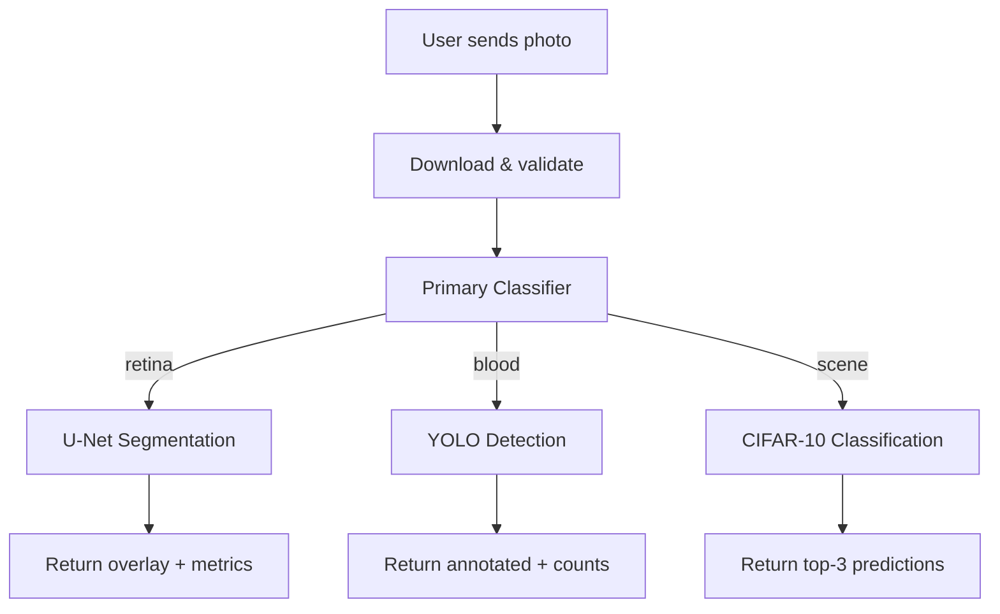

# 🤖 Medical Image Analysis Telegram Bot

Telegram бот для автоматического анализа медицинских и общих изображений с использованием глубокого обучения.

## 📋 Возможности

### 1. 🔬 Сегментация сетчатки (Retina Vessel Segmentation)
- **Модель:** U-Net
- **Точность:** Dice 0.51
- **Функция:** Выделение кровеносных сосудов на снимках глазного дна
- **Визуализация:** Overlay с красными сосудами

### 2. 🩸 Детекция клеток крови (Blood Cell Detection)
- **Модель:** YOLOv8n
- **Точность:** mAP50 0.935 (93.5%)
- **Классы:** WBC, RBC, Platelets
- **Функция:** Подсчёт и локализация клеток
- **Визуализация:** Bounding boxes с цветами по типам

### 3. 🌅 Классификация сцен (Scene Classification)
- **Модель:** ResNet-18
- **Точность:** 85%+
- **Классы:** 10 категорий CIFAR-10
  - airplane, automobile, bird, cat, deer
  - dog, frog, horse, ship, truck
- **Функция:** Распознавание объектов
- **Визуализация:** Top-3 predictions

## 🏗️ Архитектура

```
bot/
├── __init__.py          # Package initialization
├── main.py              # Entry point, bot initialization
├── config.py            # Configuration and messages
├── handlers.py          # Message and command handlers
├── models_loader.py     # Centralized models management
└── utils.py             # Helper functions

Workflow:
User → Photo → Primary Classifier → [retina/blood/scene] → Model → Result
```

## 🚀 Запуск

### 1. Подготовка

Убедитесь, что обучены все модели:
```bash
# U-Net (если ещё не обучен)
./train_unet_retina.sh

# YOLOv8 (если ещё не обучен)
./train_blood_detector.sh

# CIFAR-10 (если ещё не обучен)
./train_cifar10_classifier.sh
```

### 2. Настройка токена

Создайте файл `.env` в корне проекта:
```bash
TELEGRAM_BOT_TOKEN=your_bot_token_here
```

Получить токен: [@BotFather](https://t.me/BotFather)

### 3. Запуск бота

```bash
./run_bot.sh
```

Или напрямую:
```bash
conda activate ml-python312
python -m bot.main
```

## 📱 Использование

### Команды

- `/start` - Начать работу, показать приветствие
- `/help` - Подробная справка

### Отправка фото

1. Откройте бота в Telegram
2. Отправьте фото (JPG, PNG, до 10 МБ)
3. Бот автоматически:
   - Определит тип изображения
   - Применит соответствующую модель
   - Вернёт результат анализа

## 🔄 Pipeline обработки



## 🎨 Примеры ответов

### Retina
```
🔬 Сегментация сетчатки

✅ Обработано успешно!

📊 Результаты:
• Сосуды выделены красным цветом
• Площадь сосудов: 15.3%

Метод: U-Net (Dice: 0.51)
```

### Blood
```
🩸 Детекция клеток крови

✅ Обнаружено: 52 объекта

📊 Подсчёт клеток:
**Всего клеток:** 52

• **WBC:** 2 (3.8%)
• **RBC:** 45 (86.5%)
• **Platelets:** 5 (9.6%)

Модель: YOLOv8n (mAP50: 0.935)
```

### Scene
```
🌅 Классификация сцены

✅ **Результат:** AIRPLANE
Уверенность: 87.5%

📊 Топ-3 предсказания:
🥇 **airplane** - 87.5%
🥈 **ship** - 8.2%
🥉 **bird** - 2.1%

Модель: ResNet-18 (Accuracy: 85%+)
```

## ⚙️ Конфигурация

Основные параметры в `bot/config.py`:

```python
# Limits
MAX_FILE_SIZE_MB = 10
TIMEOUT_SECONDS = 30

# Model paths
MODEL_PATHS = {
    'primary': 'models/resnet18_primary/best_model.pth',
    'unet': 'models/unet_retina/best_model.pth',
    'yolo': 'models/yolov8_bccd/weights/best.pt',
    'cifar10': 'models/resnet18_cifar10/best_model.pth'
}
```

## 🔧 Технологии

- **Фреймворк:** aiogram 3.x (async)
- **ML:** PyTorch, torchvision, ultralytics
- **Primary:** ResNet-18 (100% accuracy)
- **Segmentation:** U-Net (Dice 0.51)
- **Detection:** YOLOv8n (mAP50 0.935)
- **Classification:** ResNet-18 (85%+ accuracy)

## 📊 Производительность

| Модель | Время inference | Параметры |
|--------|----------------|-----------|
| Primary | ~0.1s | 11M |
| U-Net | ~1-2s | 7.8M |
| YOLOv8n | ~0.5-1s | 3M |
| CIFAR-10 | ~0.1s | 11M |

**Total processing time:** 5-15 секунд (включая download/upload)

## 🐛 Troubleshooting

### Bot не запускается
```bash
# Проверьте токен в .env
cat .env

# Проверьте наличие моделей
ls -la models/*/best_model.pth
ls -la models/yolov8_bccd/weights/best.pt
```

### Ошибки inference
```bash
# Проверьте логи
tail -f bot.log

# Протестируйте модели отдельно
python src/inference_primary.py
python src/inference_segmentation.py
python src/inference_detection.py
python src/inference_cifar10.py
```

### Медленная обработка
- Используйте GPU (измените DEVICE в `src/config.py`)
- Уменьшите размер изображений перед отправкой
- Проверьте CPU load

## 📝 Логирование

Логи сохраняются в `bot.log`:
```bash
# Просмотр логов в реальном времени
tail -f bot.log

# Поиск ошибок
grep ERROR bot.log
```

## 🔒 Безопасность

- Токен бота хранится в `.env` (не коммитить!)
- Ограничение размера файлов (10 МБ)
- Timeout для обработки (30 секунд)
- Очистка временных файлов

## 📈 Мониторинг

Логируются:
- Количество пользователей
- Тип обработанных изображений
- Время обработки
- Ошибки

## 🚀 Развёртывание

### Локально
```bash
./run_bot.sh
```

### На сервере
```bash
# Supervisor или systemd
# Screen/tmux session
screen -S telegram-bot
./run_bot.sh
```

## 📚 Документация

- [aiogram Documentation](https://docs.aiogram.dev/)
- [PyTorch Documentation](https://pytorch.org/docs/)
- [Ultralytics YOLO](https://docs.ultralytics.com/)

## ✅ Готовность

- [x] Архитектура бота
- [x] Обработчики команд
- [x] Интеграция моделей
- [x] Визуализация результатов
- [x] Логирование
- [x] Обработка ошибок
- [ ] Тестирование с real users
- [ ] Production deployment

---

**Автор:** Final Work Project  
**Версия:** 1.0.0  
**Python:** 3.12  
**Лицензия:** MIT
